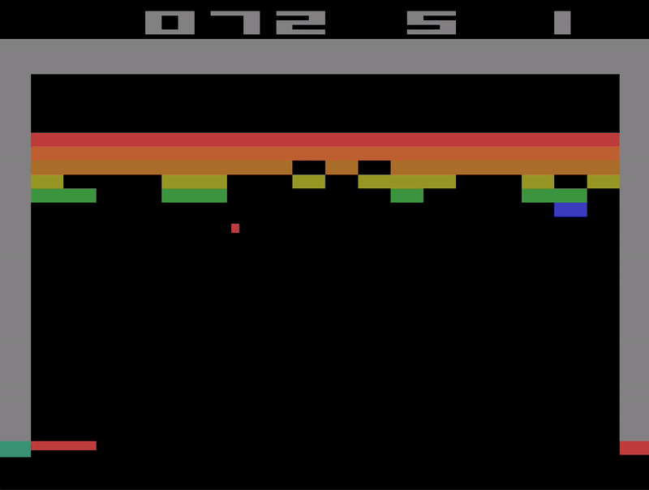
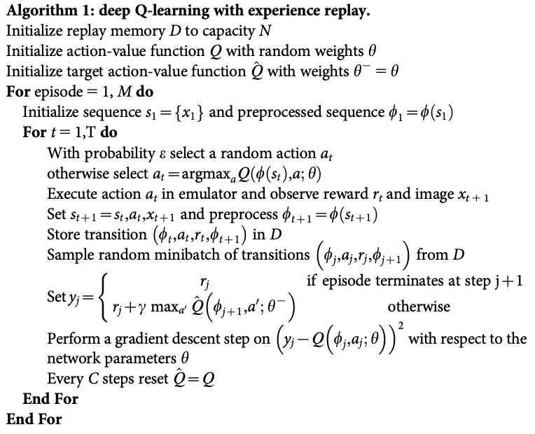
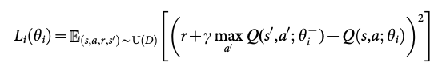
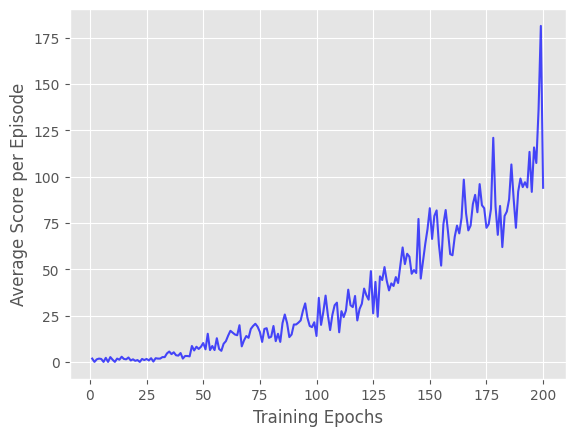
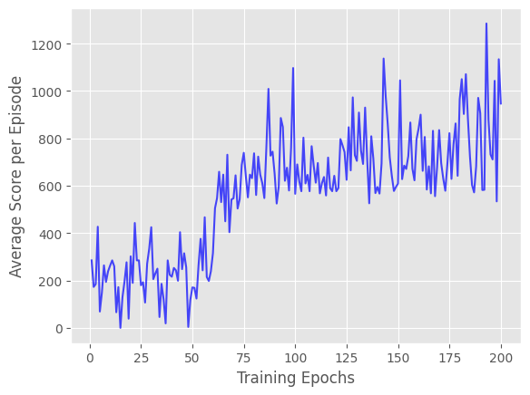

# Atari-DQN
Learning atari games using the Deep Q-network (DQN) described in the paper ["Human-level control through deep reinforcement learning"](https://www.nature.com/articles/nature14236).

| | |
| ------------------------- | -------------------- |
|  |  | 

*Gif: Trained Deep Q-network playing SpaceInvaders (left) and Breakout (right). Follow [Usage](#usage) to achieve the same results.*

| | |
| ------------------------- | -------------------------------- | 
|  |  |
| *Algorithm used to train the deep Q-network. Taken from ["Human-level control through deep reinforcement learning"](https://www.nature.com/articles/nature14236).* | *Equation: Q-learning Objective. Taken from ["Human-level control through deep reinforcement learning"](https://www.nature.com/articles/nature14236).* |

## Usage

**Note: Make sure you have installed all required dependencies.**

Follow these steps to train your own Deep Q-network.

### 1. Training

Select your Atari-2600 environment of choice (here illustrated using SpaceInvaders), then run:

```bash
python3 train.py --env_id="ALE/SpaceInvaders-v5" --device="cuda" --action_dim=6 --state_ch=4
```

Or:

```python
from dqn.dqn import AtariDQN
from env import make_atari_env


dqn = AtariDQN(
    state_ch=4,
    action_dim=6,
    batch_size=32,
    buffer_capacity=1_000_000,  # make sure you have enough RAM
    device="cuda"
) 
env = make_atari_env("ALE/SpaceInvaders-v5")  # replace with your env of choice
dqn.learn(env, 50_000_000)      # training steps
```

### 2. Play

To see how the trained Deep Q-network performs, run:

```bash
python3 play.py --env_id="ALE/SpaceInvaders-v5" --device="cuda" --action_dim=6 --state_ch=4
```

## Evaluation

Training on SpaceInvaders and Breakout took approximately 30 hours on a RTX 3060 (8GB).

| | | 
| -------------- | ----------- |
|  |  |

*Figure (left): Average Score per Episode on Breakout (10 rollouts). One Episode corresponds to 50000 timesteps.*

*Figure (right): Average Score per Episode on SpaceInvaders (10 rollouts). One Episode corresponds to 50000 timesteps.*

## Experimental setup

* OS: Fedora Linux 42 (Workstation Edition) x86_64
* CPU: AMD Ryzen 5 2600X (12) @ 3.60 GHz
* GPU: NVIDIA GeForce RTX 3060 ti (8GB VRAM)
* RAM: 32 GB DDR4 3200 MHz

## Citations

```bibtex
@article{mnih2015humanlevel,
  added-at = {2015-08-26T14:46:40.000+0200},
  author = {Mnih, Volodymyr and Kavukcuoglu, Koray and Silver, David and Rusu, Andrei A. and Veness, Joel and Bellemare, Marc G. and Graves, Alex and Riedmiller, Martin and Fidjeland, Andreas K. and Ostrovski, Georg and Petersen, Stig and Beattie, Charles and Sadik, Amir and Antonoglou, Ioannis and King, Helen and Kumaran, Dharshan and Wierstra, Daan and Legg, Shane and Hassabis, Demis},
  biburl = {https://www.bibsonomy.org/bibtex/2fb15f4471c81dc2b9edf2304cb2f7083/hotho},
  description = {Human-level control through deep reinforcement learning - nature14236.pdf},
  interhash = {eac59980357d99db87b341b61ef6645f},
  intrahash = {fb15f4471c81dc2b9edf2304cb2f7083},
  issn = {00280836},
  journal = {Nature},
  keywords = {deep learning toread},
  month = feb,
  number = 7540,
  pages = {529--533},
  publisher = {Nature Publishing Group, a division of Macmillan Publishers Limited. All Rights Reserved.},
  timestamp = {2015-08-26T14:46:40.000+0200},
  title = {Human-level control through deep reinforcement learning},
  url = {http://dx.doi.org/10.1038/nature14236},
  volume = 518,
  year = 2015
}

@article{mnih2013atari,
  abstract = {We present the first deep learning model to successfully learn control
policies directly from high-dimensional sensory input using reinforcement
learning. The model is a convolutional neural network, trained with a variant
of Q-learning, whose input is raw pixels and whose output is a value function
estimating future rewards. We apply our method to seven Atari 2600 games from
the Arcade Learning Environment, with no adjustment of the architecture or
learning algorithm. We find that it outperforms all previous approaches on six
of the games and surpasses a human expert on three of them.},
  added-at = {2019-07-12T20:11:01.000+0200},
  author = {Mnih, Volodymyr and Kavukcuoglu, Koray and Silver, David and Graves, Alex and Antonoglou, Ioannis and Wierstra, Daan and Riedmiller, Martin},
  biburl = {https://www.bibsonomy.org/bibtex/2a00ec4c09f5dc9b3f8a1836f4e02bb5d/lanteunis},
  interhash = {78966703f649bae69a08a6a23a4e8879},
  intrahash = {a00ec4c09f5dc9b3f8a1836f4e02bb5d},
  keywords = {},
  note = {cite arxiv:1312.5602Comment: NIPS Deep Learning Workshop 2013},
  timestamp = {2019-07-12T20:11:01.000+0200},
  title = {Playing Atari with Deep Reinforcement Learning},
  url = {http://arxiv.org/abs/1312.5602},
  year = 2013
}
```